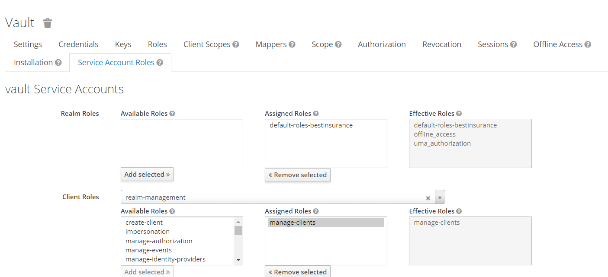

# Keycloak Secrets via Vault

The purpose of this plugin is to provide Keycloak client secrets from Vault. 

Please read the [Vault Plugin](https://www.vaultproject.io/docs/plugins) documentation for how to enable and handle plugins in Vault.

## Dev Setup

### Register plugin for Dev Mode

- Clone this repository:

```
git clone git@github.com:ahmed-medhat-tawfiq/vault-plugin-secrets-keycloak.git
```

- Download Release:

Go to https://github.com/ahmed-medhat-tawfiq/vault-plugin-secrets-keycloak/releases and download the latest release in the repo root directory.


- Unzip the release file and copy the plugin binary into the vault plugin folder:

```
unzip vault-plugin-secrets-keycloak_0.7.0_linux_amd64.zip
cp ./vault-plugin-secrets-keycloak_v0.7.0 ./vault/plugins/keycloak-client-secrets
chmod +x ./vault/plugins/keycloak-client-secrets
```


- Generate the sha256 checksum of the plugin:

```
sha256sum ./vault/plugins/keycloak-client-secrets
```

- Run vault and keycloak:

```
docker-compose up -d
```

NOTE:
  - vault token is `root` http://localhost:8200
  - keycloak admin username is `admin` and password is `12345` http://localhost:6011/auth


- Then register the plugin using the hash generated from the previous step:

```
curl --location --request POST 'http://localhost:8200/v1/sys/plugins/catalog/secret/keycloak-client-secrets' \
--header 'X-Vault-Token: root' \
--header 'Content-Type: application/json' \
--data-raw '{
  "sha256": "<hash>", //add the generated hash here i.e. 56de501d037ebe7020d819a41f39f4ef5be5e85430f34865a667b2bb5a454ad2
  "command": "keycloak-client-secrets",
  "type": "secret",
  "version": "1"
}'
```

- Mount the plugin:

```
curl --location --request POST 'http://localhost:8200/v1/sys/mounts/keycloak-client-secrets' \
--header 'X-Vault-Token: root' \
--header 'Content-Type: application/json' \
--data-raw '{"type": "keycloak-client-secrets"}'
```

Now, the plugin can be used in Vault.


### Dev Usage

NOTE: you can find all vault curls in `Vault-Plugins.postman_collection.json` postman collection.

#### Master Realm

- You need to login to keycloak admin 1st and in the **Master Realm** create a client called `vault` with `confidential` access type, `Service Accounts Enabled`, `Authorization Enabled`, and give it the `manage-clients` role.



- register this `vault` client in the `connection` config of the `keycloak-client-secrets` secrets engine:

```
curl --location --request PUT 'http://localhost:8200/v1/keycloak-client-secrets/config/connection' \
--header 'X-Vault-Token: root' \
--header 'Content-Type: application/json' \
--data-raw '{
    "server_url": "http://keycloak:8080/auth",
    "realm": "master",
    "client_id": "vault",
    "client_secret": "<secret>" //this is the client secret of the [vault] keycloak client
  }'
```

- create another client in the **Master Realm** called `test` with `confidential` access type, `Service Accounts Enabled`, `Authorization Enabled`. this client will be accessed by the `vault` client to get the client secret and to get its token

- Get the client secret of the `test` client:

```
curl --location --request GET 'http://localhost:8200/v1/keycloak-client-secrets/clients/test/secret' \
--header 'X-Vault-Token: root'
```

- Get the token of the `test` client:

```
curl --location --request GET 'http://localhost:8200/v1/keycloak-client-secrets/clients/test/token' \
--header 'X-Vault-Token: root'
```


#### Per Realm

Same as master realm

- Create a new realm called `bestrealm` 

- Create a new client called `vault` with `confidential` access type, `Service Accounts Enabled`, `Authorization Enabled`, and give it the `manage-clients` role.

- register this `vault` client in the `connection` config of the `keycloak-client-secrets` secrets engine:

```
curl --location --request PUT 'http://localhost:8200/v1/keycloak-client-secrets/config/connection' \
--header 'X-Vault-Token: root' \
--header 'Content-Type: application/json' \
--data-raw '{
    "server_url": "http://keycloak:8080/auth",
    "realm": "bestrealm",
    "client_id": "vault",
    "client_secret": "<secret>" //this is the client secret of the [vault] keycloak client
  }'
```

- create another client in the **bestrealm** called `test` with `confidential` access type, `Service Accounts Enabled`, `Authorization Enabled`. this client will be accessed by the `vault` client to get the client secret and to get its token

- Get the client secret of the `test` client:

```
curl --location --request GET 'http://localhost:8200/v1/keycloak-client-secrets/realms/bestrealm/clients/test/secret' \
--header 'X-Vault-Token: root'
```

- Get the token of the `test` client:

```
curl --location --request GET 'http://localhost:8200/v1/keycloak-client-secrets/realms/bestrealm/clients/test/token' \
--header 'X-Vault-Token: root'
```


